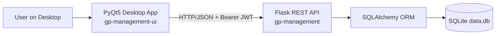
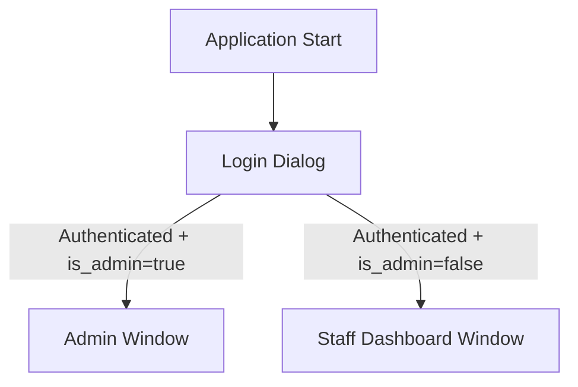
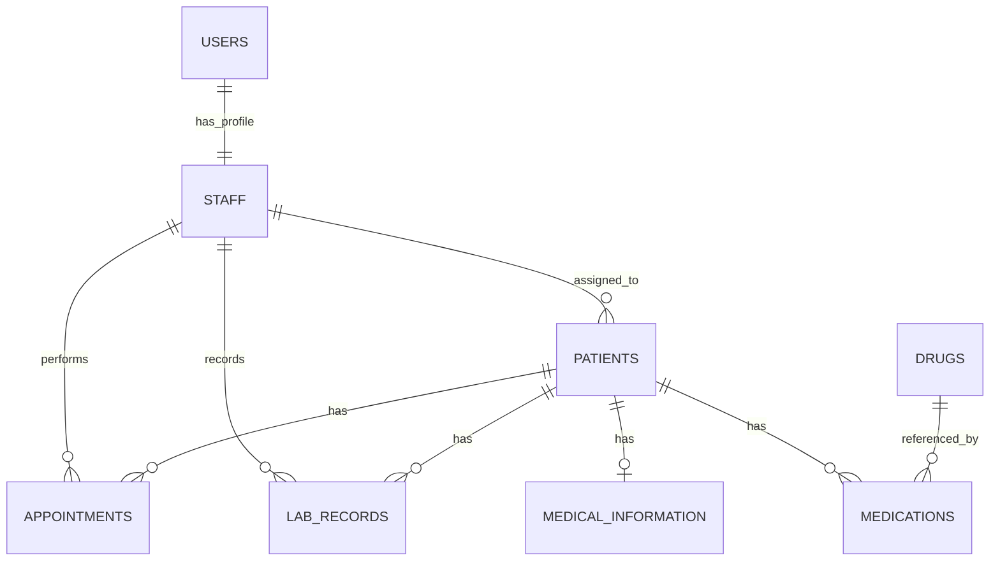

# Evaluation of the coursework project - GP management system

## Table of Contents

- [Initial aims of the project](#initial-aims-of-the-project)
- [Technologies used](#technologies-used)
- [System Architecture](#system-architecture)
  - [High-Level Architecture](#high-level-architecture)
  - [Backend Architecture (`gp-management`)](#backend-architecture-gp-management)
    - [Backend Initialization Flow](#backend-initialization-flow)
    - [Backend Component Responsibilities](#backend-component-responsibilities)
  - [Frontend Architecture (`gp-management-ui`)](#frontend-architecture-gp-management-ui)
    - [Frontend Window Routing](#frontend-window-routing)
- [Database Design](#database-design)
  - [Main Entities](#main-entities)
  - [Relationship Overview](#relationship-overview)
  - [Notable Data Rules](#notable-data-rules)
- [API Design](#api-design)
  - [API Style and Conventions](#api-style-and-conventions)
  - [Endpoint Groups](#endpoint-groups)
    - [Authentication and User APIs](#authentication-and-user-apis)
    - [Domain APIs](#domain-apis)
  - [Filtering Patterns](#filtering-patterns)
  - [Request and Response Characteristics](#request-and-response-characteristics)
- [User Interface Design](#user-interface-design)
  - [Login and Session UX](#login-and-session-ux)
  - [Admin Interface (`AdminWindow`)](#admin-interface-adminwindow)
  - [Staff Interface (`StaffDashboardWindow`)](#staff-interface-staffdashboardwindow)
  - [Input Validation and UX Behavior](#input-validation-and-ux-behavior)
- [Testing and Quality Assurance](#testing-and-quality-assurance)
- [Conclusion](#conclusion)

## Initial aims of the project

The aim of the project was to create a GP management system that would allow efficient management of patient records, appointments, and prescriptions. The system was designed to be user-friendly and accessible to system administrators and healthcare professionals. The following requirements were identified for the project:

1. User authentication and authorization: The system should have a secure login mechanism to ensure that only authorized users can access patient records and other sensitive information.
2. Patient record management: The system should allow healthcare professionals to create, view, update, and delete patient records. Each record should include personal information, medical history, and current medications.
3. Appointment scheduling: The system should enable healthcare professionals to schedule appointments with patients, view upcoming appointments, and manage appointment cancellations or rescheduling.
4. Prescription management: The system should allow healthcare professionals to create, view, update, and delete prescriptions for patients. Each prescription should include medication details, dosage, and duration.
5. Reporting and analytics: The system should provide reporting and analytics features to help healthcare professionals track patient outcomes, medication usage, and appointment trends.

This project did not aim to implement a production-ready system, but rather focused on development and learning objectives, such as understanding software development processes, applying design patterns, using Object-Oriented Programming (OOP) principles, and improving coding skills. The project was intended to be a learning experience for the students, rather than a fully functional system for real-world use.
Wherefore, there were some simplifications, for example the Sqlite3 database was used for the persistence layer, which is not suitable for production use, but it allowed for easy setup and development. Additionally, the user interface was designed to be simple and functional, rather than visually appealing or user-friendly, as the focus was on the backend functionality and learning objectives. Also, the system was not designed to handle large volumes of data or concurrent users and implements very basic security framework for user authentication and authorization.

## Technologies used

The project was developed using Python 3.X as the primary programming language, with the Flask web framework for building the web application. The Sqlite3 database was used for data storage, and SQLAlchemy was used as an Object-Relational Mapping (ORM) tool to interact with the database. The Marshmallow library was used for data validation and serialization, while PyQt5 was used for building the desktop user interface. The project also utilized JWT (JSON Web Tokens) for user authentication and authorization.

## System Architecture

### High-Level Architecture


As it can be seen from the diagram, the system is divided into two main components: the backend API (`gp-management`) and the frontend desktop application (`gp-management-ui`). The backend API is responsible for handling all business logic, data persistence, and authentication, while the frontend application provides a user interface for interacting with the system.

### Backend Architecture (`gp-management`)
The source code for this part can be found in GitHub repository:
```shell
https://github.com/PeterMironenko/gp-management
```
The backend follows a resource-oriented Flask architecture:

1. **Application bootstrap** (`app.py`)
2. **Resource layer** (`resources/*.py`) with Flask-Smorest blueprints
3. **Validation/serialization layer** (`schemas/*.py`)
4. **Persistence layer** (`models/*.py`) with SQLAlchemy entities

#### Backend Initialization Flow

1. Flask app and Flask-Smorest API are initialized.
2. SQLAlchemy is configured and models are created.
3. JWT manager is configured (token expiry, blocklist checks, claim injection).
4. Default data bootstrap runs:
	1. Ensures default positions (`doctor`, `nurse`, `physician`, `paramedic`).
	2. Ensures default admin user (ID `1`).
5. Resource blueprints are registered.

#### Backend Component Responsibilities

1. **`app.py`**
	1. Core app config
	2. JWT hooks (expired/invalid/revoked handlers)
	3. Bootstrap routines
2. **`resources/user.py`**
	1. Register/login/logout/refresh
	2. Admin-only user management APIs
	3. Automatic linked `StaffModel` creation/synchronization for users
3. **Other resources (`patient`, `appointment`, `drug`, `labrecord`, `medicalinformation`, `medication`, `position`)**
	1. CRUD endpoints
	2. Query-filter support on selected lists (for example, by `patient_id` or `staff_id`)

### Frontend Architecture (`gp-management-ui`)

The source code for this part can be found in GitHub repository:
```shell
https://github.com/PeterMironenko/gp-management-ui
```

The frontend is a desktop GUI application using PyQt5 widgets and a centralized API client.

1. **Entry point** (`main.py`)
	1. Starts Qt application
	2. Opens login dialog
	3. Routes user to role-appropriate main window
2. **Transport client** (`apiclient.py`)
	1. Wraps all backend endpoint calls
	2. Handles bearer token and error normalization
	3. Decodes JWT payload client-side to infer role and user identity
3. **UI windows**
	1. **`AdminWindow`**: multi-tab management interface
	2. **`StaffDashboardWindow`**: staff-focused appointments and patient workflows
	3. Supporting dialogs for create/update/filter/delete operations

#### Frontend Window Routing



## Database Design

### Main Entities

The SQLAlchemy model set includes:

1. `UserModel`
2. `StaffModel`
3. `PositionModel`
4. `PatientModel`
5. `AppointmentModel`
6. `DrugModel`
7. `MedicationModel`
8. `LabRecordModel`
9. `MedicalInformationModel`

### Relationship Overview



### Notable Data Rules

1. `StaffModel.user_id` is unique (1:1 user-to-staff linkage).
2. Phone/email uniqueness is enforced for staff and patient contact fields.
3. Patient child entities (appointments/lab records/medications/medical information) use ORM cascade delete behavior.
4. `MedicationModel.is_approved` supports approval workflow for approval-required drugs.

## API Design

### API Style and Conventions

1. REST-style endpoints with JSON payloads.
2. Flask-Smorest schemas validate request/response bodies.
3. JWT bearer auth used for protected operations.
4. OpenAPI/Swagger UI exposed by backend configuration.

### Endpoint Groups

#### Authentication and User APIs

1. `POST /register` - create user (and linked staff profile).
2. `POST /login` - issue access and refresh tokens.
3. `POST /logout` - revoke current token (admin-gated in current implementation).
4. `POST /refresh` - refresh access token.
5. `GET /me` - current authenticated user profile.
6. `GET /user`, `GET /user/<id>`, `PUT /user/<id>`, `DELETE /user/<id>` - user administration.

#### Domain APIs

1. `GET /position` - list supported staff positions.
2. `GET/POST /patient`, `GET/PUT/DELETE /patient/<id>`
3. `GET/POST /appointment`, `GET/PUT/DELETE /appointment/<id>`
4. `GET/POST /drug`, `GET/PUT/DELETE /drug/<id>`
5. `GET/POST /labrecord`, `GET/PUT/DELETE /labrecord/<id>`
6. `GET/POST /medicalinformation`, `GET/PUT/DELETE /medicalinformation/<id>`
7. `GET/POST /medication`, `GET/PUT/DELETE /medication/<id>`

### Filtering Patterns

List endpoints support common query filtering for UI efficiency:

1. `GET /patient?staff_id=<id>`
2. `GET /appointment?patient_id=<id>`
3. `GET /labrecord?patient_id=<id>`
4. `GET /medicalinformation?patient_id=<id>`
5. `GET /medication?patient_id=<id>`

### Request and Response Characteristics

1. Successful list operations typically return JSON arrays of entity objects.
2. Successful create operations return `201` with the created object.
3. Validation/business rule failures return structured error payloads with appropriate status codes.
4. Authentication failures return JWT-specific error payloads (`token_expired`, `invalid_token`, etc.).

## User Interface Design

### Login and Session UX

1. Login dialog captures backend URL, username, and password.
2. Backend URL can be configured at login and persisted by `ConfigManager`.
3. On success, UI opens role-specific main window.

### Admin Interface (`AdminWindow`)

`AdminWindow` is organized as a tabbed console:

1. **User Management**
	1. List users with profile metadata
	2. Create/update/delete user and linked staff fields
	3. Filter/search dialog for user records
2. **Patient Management**
	1. List and manage patients
	2. Filter/search and context-menu actions
3. **Drug Management**
	1. Maintain drug catalog
	2. Track whether drug requires approval
4. **Approval Required**
	1. Displays medication rows where related drug requires approval
	2. Supports approval actions
5. **Patient Assignment**
	1. Assign/unassign patients to selected staff members
	2. Two-pane transfer-style workflow

### Staff Interface (`StaffDashboardWindow`)

Primary tabs include:

1. **Appointments**
	1. Staff-context title with role/name
	2. Date-range filtering and CRUD dialogs
	3. Patient-scoped appointment retrieval
2. **Patients**
	1. Staff-focused patient workspace
	2. Access to clinical records workflows (appointments, medication, labs, medical info)

### Input Validation and UX Behavior

1. Locale-aware date parsing with fallback to ISO format.
2. Basic phone/email validation in dialogs before API submission.
3. Consistent modal dialogs for create/update/delete confirmations.
4. Table-driven interaction patterns with context menus and double-click edit.

## Testing and Quality Assurance

To ensure code quality and reliability, the project includes unit tests for both backend and frontend components. The backend tests cover API endpoint functionality, data validation, and authentication flows using Flask's test client. The frontend tests utilize PyQt5's testing utilities to simulate user interactions and verify UI behavior. All tests resides in the `tests/` directory of their respective repositories and can be run using standard pytest commands.

## Conclusion

This coursework project provided a comprehensive learning experience in full-stack application development, covering backend API design, database modeling, frontend UI development, and integration testing. The GP management system serves as a functional prototype that demonstrates key software engineering principles and practices.

At the beginning of the project I invested significant time in studying the PyQt5 and Flask frameworks, as well as best practices for REST API design and JWT-based authentication. This foundational knowledge was crucial for successfully implementing the system's features and architecture. This is why when I was implementing the prototype project, I had not finished my studies yet and as a result, the prototype code was significantly reworked and refactored later as I learned more about the frameworks and design patterns. 
The final implementation reflects a more mature understanding of software design principles, such as separation of concerns, modularity, and maintainability, which I developed over the course of the project.

I used these resources and books as references during the project development:

1. https://wiki.python.org/moin/BeginnersGuide/Programmers
2. https://github.com/tecladocode/rest-apis-flask-python
3. Martin Fitzpatrick, "Create GUI Applications with Python & Qt5", 2018, https://www.martinfitzpatrick.com/pyqt5-book/qt-for-python/
