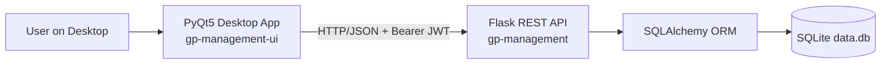
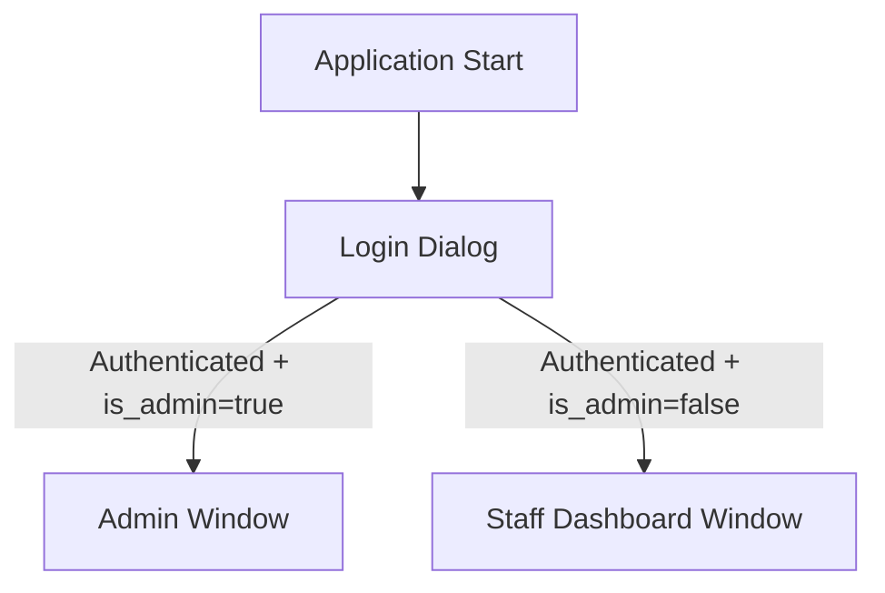
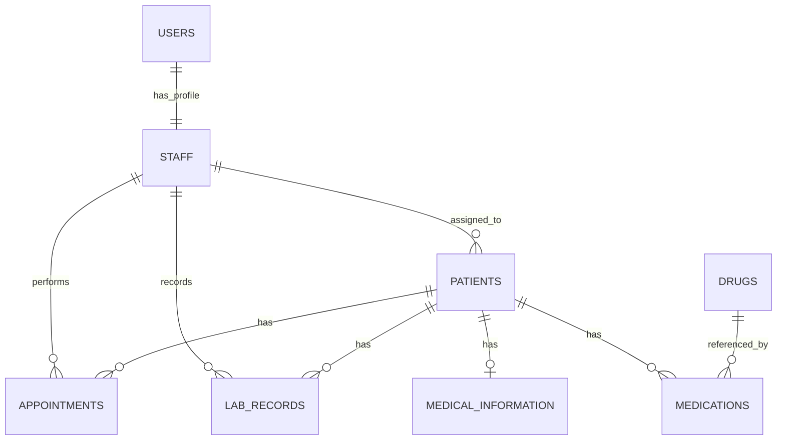

# GP Management System Design Document

## Table of Contents

- [Overview](#overview)
- [Aims and Objectives](#aims-and-objectives)
- [Scope and Limitations](#scope-and-limitations)
	- [In Scope](#in-scope)
	- [Current Limitations](#current-limitations)
- [System Architecture](#system-architecture)
	- [High-Level Architecture](#high-level-architecture)
	- [Backend Architecture (`gp-management`)](#backend-architecture-gp-management)
	- [Frontend Architecture (`gp-management-ui`)](#frontend-architecture-gp-management-ui)
- [Database Design](#database-design)
	- [Main Entities](#main-entities)
	- [Relationship Overview](#relationship-overview)
	- [Notable Data Rules](#notable-data-rules)
- [API Design](#api-design)
	- [API Style and Conventions](#api-style-and-conventions)
	- [Endpoint Groups](#endpoint-groups)
	- [Filtering Patterns](#filtering-patterns)
	- [Request and Response Characteristics](#request-and-response-characteristics)
- [User Interface Design](#user-interface-design)
	- [Login and Session UX](#login-and-session-ux)
	- [Admin Interface (`AdminWindow`)](#admin-interface-adminwindow)
	- [Staff Interface (`StaffDashboardWindow`)](#staff-interface-staffdashboardwindow)
	- [Input Validation and UX Behavior](#input-validation-and-ux-behavior)
- [End-to-End Functional Flows](#end-to-end-functional-flows)
	- [Flow A: Admin Creates a New User](#flow-a-admin-creates-a-new-user)
	- [Flow B: Staff Manages Appointments](#flow-b-staff-manages-appointments)
	- [Flow C: Medication Approval Pipeline](#flow-c-medication-approval-pipeline)
- [Deployment and Runtime Considerations](#deployment-and-runtime-considerations)
- [Future Improvements](#future-improvements)

## Overview

The GP Management system is composed of two Python applications:

1. **`gp-management`**: a Flask REST backend using SQLAlchemy and SQLite.
2. **`gp-management-ui`**: a PyQt5 desktop frontend that consumes the backend API.

The system supports role-based workflows for:

1. Authentication and user administration.
2. Staff profile and position management.
3. Patient administration and assignment to staff.
4. Clinical data management: appointments, medications, lab records, and medical information.
5. Medication approval workflow for drugs that require approval.

## Aims and Objectives

1. Provide a lightweight, self-hosted GP management platform for local use and testing.
2. Keep business logic in the backend and use the desktop UI as a thin client.
3. Enforce admin/staff role separation in core administrative workflows.
4. Support complete CRUD operations for key clinical entities.
5. Enable simple deployment on developer machines (Windows, Linux, macOS) with optional Docker support.

## Scope and Limitations

### In Scope

1. JWT-based login and authenticated API interaction.
2. Admin panel with user/patient/drug/approval/assignment tabs.
3. Staff dashboard with appointments and patient-centric workflows.
4. SQLite persistence with SQLAlchemy ORM relationships.

### Current Limitations

1. Backend currently uses SQLite (`sqlite:///data.db`) and is optimized for development/small deployments.
2. The JWT signing secret is generated at runtime; restarting the backend invalidates previously issued tokens.
3. Several domain endpoints are not consistently protected by JWT/admin checks (security hardening opportunity).
4. Role model is basic: admin is inferred from JWT claim (`is_admin`) currently tied to user identity logic.
5. No background job processing, audit log pipeline, or distributed deployment orchestration.

## System Architecture

### High-Level Architecture

### Backend Architecture (`gp-management`)

The backend follows a resource-oriented Flask architecture:

1. **Application bootstrap** (`app.py`)
2. **Resource layer** (`resources/*.py`) with Flask-Smorest blueprints
3. **Validation/serialization layer** (`schemas/*.py`)
4. **Persistence layer** (`models/*.py`) with SQLAlchemy entities

#### Backend Initialization Flow

1. Flask app and Flask-Smorest API are initialized.
2. SQLAlchemy is configured and models are created.
3. JWT manager is configured (token expiry, blocklist checks, claim injection).
4. Default data bootstrap runs:
	1. Ensures default positions (`doctor`, `nurse`, `physician`, `paramedic`).
	2. Ensures default admin user (ID `1`).
5. Resource blueprints are registered.

#### Backend Component Responsibilities

1. **`app.py`**
	1. Core app config
	2. JWT hooks (expired/invalid/revoked handlers)
	3. Bootstrap routines
2. **`resources/user.py`**
	1. Register/login/logout/refresh
	2. Admin-only user management APIs
	3. Automatic linked `StaffModel` creation/synchronization for users
3. **Other resources (`patient`, `appointment`, `drug`, `labrecord`, `medicalinformation`, `medication`, `position`)**
	1. CRUD endpoints
	2. Query-filter support on selected lists (for example, by `patient_id` or `staff_id`)

### Frontend Architecture (`gp-management-ui`)

The frontend is a desktop GUI application using PyQt5 widgets and a centralized API client.

1. **Entry point** (`main.py`)
	1. Starts Qt application
	2. Opens login dialog
	3. Routes user to role-appropriate main window
2. **Transport client** (`apiclient.py`)
	1. Wraps all backend endpoint calls
	2. Handles bearer token and error normalization
	3. Decodes JWT payload client-side to infer role and user identity
3. **UI windows**
	1. **`AdminWindow`**: multi-tab management interface
	2. **`StaffDashboardWindow`**: staff-focused appointments and patient workflows
	3. Supporting dialogs for create/update/filter/delete operations

#### Frontend Window Routing

## Database Design

### Main Entities

The SQLAlchemy model set includes:

1. `UserModel`
2. `StaffModel`
3. `PositionModel`
4. `PatientModel`
5. `AppointmentModel`
6. `DrugModel`
7. `MedicationModel`
8. `LabRecordModel`
9. `MedicalInformationModel`

### Relationship Overview

### Notable Data Rules

1. `StaffModel.user_id` is unique (1:1 user-to-staff linkage).
2. Phone/email uniqueness is enforced for staff and patient contact fields.
3. Patient child entities (appointments/lab records/medications/medical information) use ORM cascade delete behavior.
4. `MedicationModel.is_approved` supports approval workflow for approval-required drugs.

## API Design

### API Style and Conventions

1. REST-style endpoints with JSON payloads.
2. Flask-Smorest schemas validate request/response bodies.
3. JWT bearer auth used for protected operations.
4. OpenAPI/Swagger UI exposed by backend configuration.

### Endpoint Groups

#### Authentication and User APIs

1. `POST /register` - create user (and linked staff profile).
2. `POST /login` - issue access and refresh tokens.
3. `POST /logout` - revoke current token (admin-gated in current implementation).
4. `POST /refresh` - refresh access token.
5. `GET /me` - current authenticated user profile.
6. `GET /user`, `GET /user/<id>`, `PUT /user/<id>`, `DELETE /user/<id>` - user administration.

#### Domain APIs

1. `GET /position` - list supported staff positions.
2. `GET/POST /patient`, `GET/PUT/DELETE /patient/<id>`
3. `GET/POST /appointment`, `GET/PUT/DELETE /appointment/<id>`
4. `GET/POST /drug`, `GET/PUT/DELETE /drug/<id>`
5. `GET/POST /labrecord`, `GET/PUT/DELETE /labrecord/<id>`
6. `GET/POST /medicalinformation`, `GET/PUT/DELETE /medicalinformation/<id>`
7. `GET/POST /medication`, `GET/PUT/DELETE /medication/<id>`

### Filtering Patterns

List endpoints support common query filtering for UI efficiency:

1. `GET /patient?staff_id=<id>`
2. `GET /appointment?patient_id=<id>`
3. `GET /labrecord?patient_id=<id>`
4. `GET /medicalinformation?patient_id=<id>`
5. `GET /medication?patient_id=<id>`

### Request and Response Characteristics

1. Successful list operations typically return JSON arrays of entity objects.
2. Successful create operations return `201` with the created object.
3. Validation/business rule failures return structured error payloads with appropriate status codes.
4. Authentication failures return JWT-specific error payloads (`token_expired`, `invalid_token`, etc.).

## User Interface Design

### Login and Session UX

1. Login dialog captures backend URL, username, and password.
2. Backend URL can be configured at login and persisted by `ConfigManager`.
3. On success, UI opens role-specific main window.

### Admin Interface (`AdminWindow`)

`AdminWindow` is organized as a tabbed console:

1. **User Management**
	1. List users with profile metadata
	2. Create/update/delete user and linked staff fields
	3. Filter/search dialog for user records
2. **Patient Management**
	1. List and manage patients
	2. Filter/search and context-menu actions
3. **Drug Management**
	1. Maintain drug catalog
	2. Track whether drug requires approval
4. **Approval Required**
	1. Displays medication rows where related drug requires approval
	2. Supports approval actions
5. **Patient Assignment**
	1. Assign/unassign patients to selected staff members
	2. Two-pane transfer-style workflow

### Staff Interface (`StaffDashboardWindow`)

Primary tabs include:

1. **Appointments**
	1. Staff-context title with role/name
	2. Date-range filtering and CRUD dialogs
	3. Patient-scoped appointment retrieval
2. **Patients**
	1. Staff-focused patient workspace
	2. Access to clinical records workflows (appointments, medication, labs, medical info)

### Input Validation and UX Behavior

1. Locale-aware date parsing with fallback to ISO format.
2. Basic phone/email validation in dialogs before API submission.
3. Consistent modal dialogs for create/update/delete confirmations.
4. Table-driven interaction patterns with context menus and double-click edit.

## Some examples of End-to-End Functional Flows

### Flow A: Admin Creates a New User

1. Admin logs in from `LoginDialog`.
2. `ApiClient.login` stores JWT access token.
3. Admin opens **User Management** and submits create dialog.
4. UI calls `POST /register`.
5. Backend creates `UserModel` plus linked `StaffModel` with default/fallback values.
6. UI refreshes list via `GET /user`.

### Flow B: Staff Manages Appointments

1. Staff logs in and opens `StaffDashboardWindow`.
2. UI resolves current staff profile via `GET /me`.
3. UI loads assigned patients (`GET /patient?staff_id=<id>`).
4. UI loads patient appointments and aggregates/sorts by datetime.
5. CRUD actions call appointment endpoints and refresh table.

### Flow C: Medication Approval Pipeline

1. Admin manages drugs; selected drugs can require approval.
2. Medication entries linked to approval-required drugs appear in **Approval Required**.
3. Admin performs approve action through the UI, updating medication approval status.

## Deployment and Runtime Considerations

1. Backend can run directly with startup scripts or via Docker Compose.
2. Frontend can target local backend or hosted backend by changing URL at login.
3. Cross-platform developer execution is supported on Windows, Linux, and macOS.

## Future Improvements

1. Improve scalability and performance of the backend services by using SQL database like PostgreSQL and implementing caching strategies.
2. Enhance security by implementing role-based access control (RBAC) and improving JWT management.
3. Add secure HTTPS connection between frontend and backend.
4. Implement background job processing for long-running tasks (e.g., medication approval notifications).
